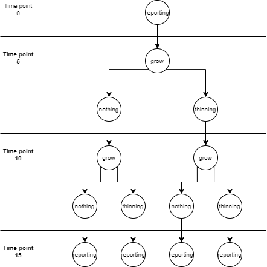
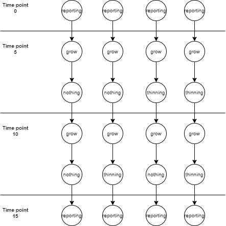
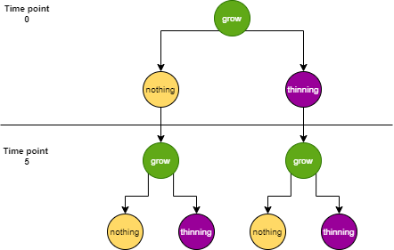
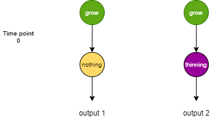
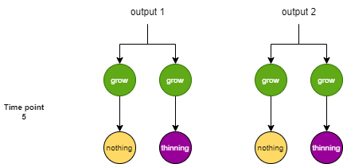

# Metsi forestry simulator

Metsi forestry simulator is a Python based forest growth and maintenance operation simulator developed in Natural
Resources Institute Finland.

The simulator is a alternative state simulator operating upon forest state data. The state data is manipulated by
**simulator operations** over a progression of time steps. The event and branching structure for simulator operations
is declared in a human-readable YAML format or directly by functional declaration. This declaration is used to generate
a **simulation event tree** holding the full branching possibilities for the simulation. The event tree is evaluated
with the simulator engine to produce alternative end results.

## Getting started

To get started:

* Install Python >= 3.10  for your platform.
* Install git for your platform.
* Ensure that the commands `python`, `pip` and `git` are available in your command line interface (CLI). We assume a
  UNIX-like shell CLI such as Git Bash for Windows users.
* Initialize the project with the commands below.

```
git clone https://github.com/lukefi/metsi
cd metsi
pip install .
```

This installs the project into the site-packages of your Python deployment, using the project's `pyproject.toml` file.
The program is then usable from command line by simply invoking `metsi`.

For developer usage, application entry point is the file `lukefi/metsi/app/metsi.py` or the namespace package
`lukefi.metsi.app.metsi`.

To obtain the latest changes use the command `git pull`.

### R (optional)

To be able to use forestry operations depending on R modules

* Install R runtime version >=4.1 for your platform.
* Ensure that the `R` command is available in CLI.
* Install the `rpy2` Python module with the commands below.

```
pip install .[rpy2]
```

### Motti (optional)

Access to this module is restricted to Natural Resources Institute Finland by special admission. Installing this will
not work without access to the related GitHub repositories.

```
pip install -r requirements-motti.txt
```

The corresponding growth operation is `grow_motti`.


**NOTE**: For either model, the input data must contain precomputed weather data (temperature sums, sea/lake indices).
In practice this means that you must enable the `compute_location_metadata` preprocessing operation **even if you're
using the Lua models**.

## Project layout

This code project is divided into following python packages in the lukefi.metsi namespace.

| package    | description                                             |
|------------|---------------------------------------------------------|
| l.m.app    | Application entry points. Side-effectful program logic. |
| l.m.sim    | Simulator engine.                                       |
| l.m.domain | Operations for the forest development simulation.       |
| l.m.tests  | Unit test suites for above packages.                    |

Dependency libraries for this project are listed in `pyproject.toml`.

## Application

The project contains a single application entry point. This is the `lukefi/metsi/app/metsi.py`.

The application implements a 4 phase pipeline. These phases are: __preprocess__, __simulate__, __postprocess__ and __export__. Each of
the phases can be run independetly or as sequences, as long as their logical order for input data structuring is
preserved. Each application phase uses the given YAML file (default `control.yaml`) as their configuration.

### Phases

| phase       | description                                                                            |
|-------------|----------------------------------------------------------------------------------------|
| preprocess  | Operations for filtering or modifying the input data set                               |
| simulate    | Discrete time-step simulation and data collection with given event tree and operations |
| postprocess | Operations for further deriving and marshalling of data from the simulation results    |
| export      | File output into different formats based on simulation or post-processing results      |

### Input types

Input for preprocess and simulate phases is a forest data file. This file is a list of forest stand objects with lists
of associated reference trees and tree strata. The file can be of following types and formats:

1. a .json file or .pickle file containing Forest Data Model type source data.
2. a .dat file containing VMI12 or VMI13 type source data
3. a .xml file containing Forest Centre type source data
4. a .gpkg file containing Forest Centre type source data

Input for postprocess and export phases is a directory produced by the simulate phase.

There are several example input files in the project test resources `tests/resources/file_io_test` and `tests/data/resources` directories.

### Output types

Preprocessing generates a csv, pickle or json file with the computational units as a list. The data is always in FDM
format. The file is written into the configured output directory as `preprocessing-result.{csv,pickle,json}`.

Simulate collects a nested data structure containing the final states for each produced alternatives of each
computational unit. A dictionary data structure for computed data during the simulation is included for each such
alternative. This data structure can be outputted as a directory structure into the configured output directory.

Post-processing utilizes exactly same nested data structure as produced by simulation. It will derive further data
within and across the produced alternatives and stores them within the derived data structure. This data can be
outputted as a directory structure into the configured output directory.

Exporting uses the nested data structure above. It will select partial data sets as configured. These data sets may be
written to any supported and compatible file containers. Such support must be implemented on a case-by-case basis as
modules into the exporting functionality.

When phases are run in order on the same run, intermediate result files do not need to be written out. Data is kept and
propagated in-memory.

#### RSD format

Despite other output formats the computational units can be outputted as a RSD format which is in itself a special format used only by the Natural Resource Institutes MELA simulator. The RSD format is only genereted as preprocessing output and contains the reference tree information of forest stands. Along with the RSD format an RSDS format file is genereted which contains the stratum information of the computationals units.

### Run examples

Use the following command to output simulator application help menu.

```
python -m lukefi.metsi.app.metsi --help
```

Input path, output path and optionally the control file path must be supplied as CLI positional arguments. All other
parameters in commands below can also be set in the `control.yaml` file `app_configuration` block. Control file settings
override program defaults (see app/app_io.py MetsiConfiguration class). CLI arguments override the settings in the
control file.

**At the time of writing this, there are no post-processing operations ready to be used. Post-processing
will `do_nothing`**

All examples below default to `control.yaml` in the working directory as the control file source unless otherwise
specified in the command line.

Preprocessing, simulation and post-processing phases do not produce output files by default. Configuration for
preprocessing output container, state output container and derived data output container need to be set to produce
output files. The default mode of operation is to run the full pipeline and only the export phase will create files as
configured.

To run full pipeline from a VMI12 data source file using direct reference trees from the input data, run:

```
python -m lukefi.metsi.app.metsi --state-format vmi12 --measured-trees -r preprocess,simulate,postprocess,export vmi12.dat sim_outdir
```

To run full pipeline from a VMI13 data source file using direct reference trees from the input data, run:

```
python -m lukefi.metsi.app.metsi --state-format vmi13 --measured-trees -r preprocess,simulate,postprocess,export vmi13.dat sim_outdir
```

To run full pipeline from a Forest Centre .xml source file, run:

```
python -m lukefi.metsi.app.metsi --state-format xml -r preprocess,simulate,postprocess,export forest_centre.xml sim_outdir
```

To run full pipeline from a Forest Centre .gpkg source file, run:

```
python -m lukefi.metsi.app.metsi --state-format gpkg -r preprocess,simulate,postprocess,export geopackage.gpkg sim_outdir
```

To run full pipeline from a FDM formatted data from csv (or json or pickle with replacement below), run:

```
python -m lukefi.metsi.app.metsi --state-input-container csv -r preprocess,simulate,postprocess,export forest_data.csv sim_outdir
```

#### Preprocessing and simulation

To run preprocess and simulate phases of the application, run the following command in the project root.
The created output directory contains all generated variants for all computation units (ForestStand) along with derived
data.

```
python -m lukefi.metsi.app.metsi --state-input-container pickle -r preprocess,simulate forest_data.pickle sim_outdir
```

In case you need to use a FDM formatted JSON file as the input and/or output file format, run:

```
python -m lukefi.metsi.app.metsi --state-input-container json --state-output-container json -r preprocess,simulate forest_data.json sim_outdir
```

To only run the preprocessor and produce output as `outdir/preprocessing_result.csv`, with a control yaml file in
non-default location `my_project/control_preprocessing.yaml`, run:

```
python -m lukefi.metsi.app.metsi --preprocessing-output-container csv -r preprocess forest_data.pickle sim_outdir my_project/control_preprocessing.yaml
```

To use the preprocessed result file as input for a simulation, and produce schedule results in csv+json format run:

```
python -m lukefi.metsi.app.metsi --state-input-container csv --state-output-container csv --derived-data-output-container json -r simulate sim_outdir/preprocessing_result.csv sim_outdir my_project/control_simulate.yaml
```

#### Post-processing and export

The output directory `outdir` from simulate is usable as input for the post-processing phase of the application.
It will create a new directory `outdir2` with matching structure for its output with the following command:

```
python -m lukefi.metsi.app.metsi -r postprocess outdir outdir2 my_project/postprocessing_control.yaml
```

The output directory `outdir` from simulation (or `outdir2` from post-processing) can be used as input for the export
phase as follows:

```
python -m lukefi.metsi.app.metsi -r export outdir outdir2 my_project/export_control.yaml
```

## Operations

See table below for a quick reference of forestry operations usable in control.yaml.

| operation                                             | description                                                                                      | source                      | model library  |
|-------------------------------------------------------|--------------------------------------------------------------------------------------------------|-----------------------------|----------------|
| do_nothing                                            | This operation is no-op utility operation to simulate rest                                       |                             | native         |
| grow_acta                                             | A simple ReferenceTree diameter and height growth operation                                      | Acta Forestalia Fennica 163 | metsi-forestry |
| grow_motti                                            | A ReferenceTree growth operation with death and birth models. Requires `pymotti`.                | Luke Motti group            | pymotti        |
| first_thinning                                        | An operation reducing the stem count of ReferenceTrees as a first thinning for a forest          | Reijo Mykkänen              | metsi-forestry |
| thinning_from_below                                   | An operation reducing the stem count of ReferenceTrees weighing small trees before large trees   | Reijo Mykkänen              | metsi-forestry |
| thinning_from_above                                   | An operation reducing the stem count of ReferenceTrees weighing large trees before small trees   | Reijo Mykkänen              | metsi-forestry |
| even_thinning                                         | An operation reducing the stem count of ReferenceTrees evenly regardless of tree size            | Reijo Mykkänen              | metsi-forestry |
| report_collectives                                    | Save the values of [collective variables](#collective-variables)                                 |                             | native         |
| calculate_biomass                                     | Calculate biomass accruals from the current reference tree properties                            | Laura Jaakkola              | native         |
| [report_state](#report_state)                         | save the values of state variables at the current time point                                     |                             | native         |
| filter                                                | [Filter](#filters) stands, trees and strata                                                      |                             | native         |
| [cross_cut_felled_trees](#cross_cut_felled_trees)     | Perform cross cut operation to results of previous thinning operations                           | Annika Kangas               | metsi-forestry |
| [cross_cut_standing_trees](#cross_cut_standing_trees) | Perform cross cut operation to all standing trees on a stand                                     | Annika Kangas               | metsi-forestry |
| [calculate_npv](#calculate_npv)                       | Calculate net present value of stand and harvest revenues subtracted by renewal operation costs. | Urho Niemelä                | native         |
| [calculate_npv](#calculate_npv)                       | Calculate net present value of stand and harvest revenues subtracted by renewal operation costs. | Urho Niemelä                | native         |
| [clearcutting](#clearcutting)                         | Clear the stand of reference trees and produce data for cross-cutting.                           | Laura Jaakkola              | native         |
| [planting](#planting)                                 | Plant sapling reference trees on an empty stand.                                                 | Laura Jaakkola              | native         |

### planting

Performes renewal operation planting which plants saplings on a empty stand.

#### **parameters**

| parameter name        | type   | description                                                                                                                                                        | location in control.yaml | notes                |
|-----------------------|--------|--------------------------------------------------------------------------------------------------------------------------------------------------------------------|--------------------------|----------------------|
| planting_instructions | string | In file rows represent site types, first column contains the tree species, second column the stems per hectar value and third column is the soil preparation type. | operation_file_params    | optional             |
| tree_count            | int    | Number of sapling trees to be plante.                                                                                                                              | operation_params         | optional, default 10 |

#### **output**

The output is written into the derived data container with two keys `renewal` and `regeneration`.

Output of renewal is a regeneration description python dictionary containing following values
regeneration key, soil prepration type, tree species and stem count.

Output of regeneration is is a list of `PriceableOperationInfo` objects:

| attribute name | type   | description                                 |
|----------------|--------|---------------------------------------------|
| operation      | string | renewal operation name                      |
| units          | float  | stand area                                  |
| time_point     | int    | time point of operation execution timepoint |

### even_thinning

Performs even thinning which removes stems evenly from all reference tree classes. Removal bounds are defined by basal
area.

#### **parameters**

| parameter name  | type  | location in control.yaml | notes              |
|-----------------|-------|--------------------------|--------------------|
| thinning_limits | float | operation_file_params    | optional parameter |
| e               | float | operation_params         | residue constant   |
| thinning_factor | float | operation_params         | removal intensity  |

#### **output**

Operation outputs a list of CrossCuttableTree objects

Object attributes:

| attribute name         | type        | description                            |
|------------------------|-------------|----------------------------------------|
| stems_per_ha           | float       | number of removed stems                |
| species                | TreeSpecies | tree species of removed reference tree |
| breast_height_diameter | float       | trees diameter at breast height        |
| height                 | float       | trees height                           |
| source                 | string      | standing or harveste                   |
| operation              | string      | operation that produced such output    |
| time_point             | int         | time point of operation execution      |
| cross_cut_done         | bool        | cross cut operation executed           |

#### **additional information**

- parameter e is a residue constant so that the removal ratio would not go under the lower limit.
    - For example e=0.2

### thinning_from_below

Performs thinning from below which primarily removes trees with a smaller diameter. Removal bounds are defined by basal
area.

#### **parameters**

| parameter name  | type  | location in control.yaml | notes              |
|-----------------|-------|--------------------------|--------------------|
| thinning_limits | float | operation_file_params    | optional parameter |
| e               | float | operation_params         | residue constant   |
| thinning_factor | float | operation_params         | removal intensity  |

#### **output**

Operation outputs a list of CrossCuttableTree objects

Object attributes:

| attribute name         | type        | description                            |
|------------------------|-------------|----------------------------------------|
| stems_per_ha           | float       | number of removed stems                |
| species                | TreeSpecies | tree species of removed reference tree |
| breast_height_diameter | float       | trees diameter at breast height        |
| height                 | float       | trees height                           |
| source                 | string      | standing or harveste                   |
| operation              | string      | operation that produced such output    |
| time_point             | int         | time point of operation execution      |
| cross_cut_done         | bool        | cross cut operation executed           |

#### **additional information**

- parameter e is a residue constant so that the removal ratio would not go under the lower limit.
    - For example e=0.2

### thinning_from_above

Performs thinning from above which primarily removes trees with a larger diameter. Removal bounds are defined by basal
area.

#### **parameters**

| parameter name  | type  | location in control.yaml | notes              |
|-----------------|-------|--------------------------|--------------------|
| thinning_limits | float | operation_file_params    | optional parameter |
| e               | float | operation_params         | residue constant   |
| thinning_factor | float | operation_params         | removal intensity  |

#### **output**

Operation outputs a list of CrossCuttableTree objects

Object attributes:

| attribute name         | type        | description                            |
|------------------------|-------------|----------------------------------------|
| stems_per_ha           | float       | number of removed stems                |
| species                | TreeSpecies | tree species of removed reference tree |
| breast_height_diameter | float       | trees diameter at breast height        |
| height                 | float       | trees height                           |
| source                 | string      | standing or harveste                   |
| operation              | string      | operation that produced such output    |
| time_point             | int         | time point of operation execution      |
| cross_cut_done         | bool        | cross cut operation executed           |

#### **additional information**

- parameter e is a residue constant so that the removal ratio would not go under the lower limit.
    - For example e=0.2

### first_thinning

Performs first thinning which primarily removes trees with a smaller diameter. Removal bounds are defined by number of
stems.

#### **parameters**

| parameter name              | type  | location in control.yaml | notes             |
|-----------------------------|-------|--------------------------|-------------------|
| dominant_height_lower_bound | float | operation_params         |                   |
| dominant_height_upper_bound | float | operation_params         |                   |
| e                           | float | operation_params         | residue constant  |
| thinning_factor             | float | operation_params         | removal intensity |

#### **output**

Operation outputs a list of CrossCuttableTree objects

Object attributes:

| attribute name         | type        | description                            |
|------------------------|-------------|----------------------------------------|
| stems_per_ha           | float       | number of removed stems                |
| species                | TreeSpecies | tree species of removed reference tree |
| breast_height_diameter | float       | trees diameter at breast height        |
| height                 | float       | trees height                           |
| source                 | string      | standing or harveste                   |
| operation              | string      | operation that produced such output    |
| time_point             | int         | time point of operation execution      |
| cross_cut_done         | bool        | cross cut operation executed           |

#### **additional information**

- parameter e is a residue constant so that the removal ratio would not go under the lower limit.
    - For example e=0.2

### report_biomass

Compute total biomass tonnages of a single forest stand.

#### **parameters**

| parameter name | type | location in control.yaml | notes                    |
|----------------|------|--------------------------|--------------------------|
| model_set      | int  | operation_params         | accepted values: 1 and 2 |

#### **additional information**

- model_set accepts following values 1, 2, 3 or 4
    - if value is 1 wood, bark, living and dead branches, foliage, stumps and roots are collected
      with model set Y
    - if value is 2 wood, bark, living and dead branches, foliage, stumps and roots are collected with model set X

#### **output**

Attributes of the BiomassData object

| attribute name  | type  |
|-----------------|-------|
| stem_wood       | float |
| stem_bark       | float |
| stem_waste      | float |
| living_branches | float |
| dead_branches   | float |
| foliage         | float |
| stumps          | float |
| roots           | float |

### report_state

Enables collecting the states of user-defined variables at the time of the operation call.

#### **parameters**

The parameters passed to the operation are the variables that the user wants to report. The parameters are key-value
pairs, where the key defines the name of the variable, and the value defines how the variable is constructed.

The operation makes available a set of collections that can be used in the definition of desired variables. These
collections are:

| name              | description                               | class whose attributes are available |
|-------------------|-------------------------------------------|--------------------------------------|
| state             | forest stand                              | `ForestStand`                        |
| reference_trees   | stand's reference trees                   | `ReferenceTrees`                     |
| felled_trees      | trees that have been thinned/clearcut     | `CrossCuttableTree`                  |
| cross_cutting     | results of cross cutting                  | `CrossCutResult`                     |
| renewal           | results of renewal operations             | `PriceableOperationInfo`             |
| net_present_value | results of net present value calculations | `NPVResult`                          |

#### **additional information**

For example, to get the total stems per hectare in the years the operation is defined for, one would
define ``report_state``'s operation parameters as:

```yaml
report_state:
  - total_stems_per_ha: reference_trees.stems_per_ha
```

The stand's reference trees are stored under the name ``reference_trees``, and the attributes defined for that name can
be used to get values. The returned `total_stems_per_ha` is the sum of the stand's trees' `stems_per_ha`s.

However, often one needs more detailed information about the state, and therefore filter only certain variables. For
example, to get the stems per hectare of pines:

```yaml
report_state:
  - total_stems_per_ha: reference_trees.stems_per_ha[reference_trees.species == 1]
```

or, to be even more fine-grained, get the stems_per_ha of pines that are not saplings:

```yaml
report_state:
  - total_stems_per_ha: reference_trees.stems_per_ha[(reference_trees.species == 1) & (reference_trees.sapling == False)]
```

Notice the parentheses around the filter conditions, when using multiple conditions.

### report_period

Operation makes it possible to collect sums of derived data collections between periods.

For example in a 30 year long simulation one could define three 10-year periods by defining report_period on time points
10, 20 and 30. As the simulation executes the report_period operation collects user-defined derived data between years
0-9, 10-19 and 20-29.

See documentation of report_state operation for definition and usage.

### clearcut

Clears the stands reference tree list and stores them as a list of `CrossCuttableTree` objects into derived data with
the `felled_trees` keyword.

#### **parameters**

| parameter name                | type   | description                                                                                                                                               | location in control.yaml | notes                                                              |
|-------------------------------|--------|-----------------------------------------------------------------------------------------------------------------------------------------------------------|--------------------------|--------------------------------------------------------------------|
| clearcutting_limits_ages      | string | In file the rows represent site type values and colums represent tree species and the values represent the smallest possible age enabled.                 | operation_file_params    | example file data/parameter_files/renewal_ages_southernFI.txt      |
| clearcutting_limits_diameters | string | In file the rows represent site type values and colums represent tree species and the values represent smallest possible breast height diameters enabled. | operation_file_params    | example file data/parameter_files/renewal_diameters_southernFI.txt |
| minimum_time_interval         | int    | After the operation is executed it will not be executed again until the `minimum_time_interval` is reached.                                               | run_constrains           |                                                                    |

#### **output**

Output object attributes:

| attribute name         | type        | description or value                   |
|------------------------|-------------|----------------------------------------|
| stems_per_ha           | float       | number of removed stems                |
| species                | TreeSpecies | tree species of removed reference tree |
| breast_height_diameter | float       | trees diameter at breast height        |
| height                 | float       | trees height                           |
| source                 | string      | value: `harvested`                     |
| operation              | string      | value: `clearcutting`                  |
| time_point             | int         | time point of operation execution      |
| cross_cut_done         | bool        | cross cut operation executed or not    |

### cross_cut_felled_trees

Calculates the volume and value of harvested trees using Annika Kangas' cross cutting algorithm. Whenever this operation
is called, it cross-cuts all thinning and clearcutting results that have been produced before it, but have not yet been
cross-cut. Given this, it is enough to call this operation once before cross cutting results are needed.

#### **additional information**

The `time_point` attribute of the resulting CrossCutResult objects will be determined by the tree's havest year, not the
year when this operation is called.

#### **parameters**

| parameter name     | type       | location in control.yaml | notes                                                  |
|--------------------|------------|--------------------------|--------------------------------------------------------|
| timber_price_table | file (csv) | operation_file_params    | timber grades must be given as integers                |
| implementation     | str        | operation_params         | py and lupa (lua) implementations available |

#### **output**

Attributes of the CrossCutResult object

| attribute name | type                                               |
|----------------|----------------------------------------------------|
| species        | TreeSpecies                                        |
| timber_grade   | int                                                |
| volume_per_ha  | float                                              |
| value_per_ha   | float                                              |
| stand_area     | float                                              |
| source         | str (either "harvested" or "standing")             |
| operation      | str (operation tag, or '' if source == "standing") |
|                |                                                    |
| time_point     | int                                                |

### cross_cut_standing_trees

Calculates the volume and value of standing trees using Annika Kangas' cross cutting algorithm at the time of the
operation call. This operation does not actually harvest the stand, but rather evaluates the the volume and value of its
trees if they were cross cut. Therefore, this operation is different from [clearcutting](#clearcutting).

#### **parameters**

| parameter name     | type       | location in control.yaml | notes                                                  |
|--------------------|------------|--------------------------|--------------------------------------------------------|
| timber_price_table | file (csv) | operation_file_params    | timber grades must be given as integers                |
| implementation     | str        | operation_params         | py and lupa (lua) implementations available |

#### **output**

Attributes of the CrossCutResult object

| attribute name | type                                |
|----------------|-------------------------------------|
| species        | TreeSpecies                         |
| timber_grade   | int                                 |
| volume_per_ha  | float                               |
| value_per_ha   | float                               |
| stand_area     | float                               |
| source         | str (either "felled" or "standing") |
| operation      | str                                 |
| time_point     | int                                 |

### calculate_npv

Calculates the Net Present Value (NPV) of a given schedule.

#### **parameters**

| parameter name | type        | location in control.yaml | notes                           |
|----------------|-------------|--------------------------|---------------------------------|
| interest_rates | list of int | operation_params         | e.g. [3], where 3 stands for 3% |
| land_values    | file (json) | operation_file_params    |                                 |
| renewal_costs  | file (csv)  | operation_file_params    |                                 |

#### **additional information**

- This operation expects that ``cross_cut_felled_trees`` has been called previously to cross cut any previous thinning
  output.
- This operation expects that ``cross_cut_standing_trees`` has been called in the same time point, so that the present
  value of the standing trees can be evaluated correctly.

#### **formula**

$$
NPV =
\underbrace{\sum_{t=0}^T \frac{h_ta}{(1+r)^t}}_\text{(1)}+
\underbrace{\frac{S_Ta}{(1+r)^T}}_\text{(2)}-
\underbrace{\sum_{t=0}^T \frac{c_ta}{(1+r)^t}}_\text{(3)}+
\underbrace{LV}_\text{(4)}

$$

where:

- $h_t$ is the per-hectare harvest revenue from the stand at time $t$

- $a$ is the stand's area in hectares

- $r$ is the interest rate

- $S_T$ is the value of standing tree stock at the final time point $T$

- $c_t$ is the per-hectare costs of stand treatment at time $t$

- $LV$ is the bare land value of the stand, calculated for the interest rate $r$.

(1) harvest revenues originate from `cross_cut_felled_trees`

(2) stand value originates from `cross_cut_standing_trees`

(3) currently, costs originate only from renewal operations

(4) Bare land values are passed in as a file parameter for the NPV operation. These values are already discounted with
the given interest rate, so no discounting happens here. See MELA 2016 reference manual p.175-176 for more information
about this.

## Testing

To run unit test suites, run in the project root

```
python -m pytest
```

You can also use python internal module unittest

```
python -m unittest <test suite module.class path>
```

# Application control

A run is declared in the YAML file `control.yaml`.

1. Application configuration in `app_configuration` object. These may be overridden by equivalent command line
   arguments. Note that e.g. `state_format` with `fdm` below is written as `--state-format fdm` when given as a command
   line argument.
    1. `state_format` specifies the data format of the input computational units
        1. `fdm` is the standard Forest Data Model.
        2. `vmi12` and `vmi13` denote the VMI data format and container.
        3. `forest_centre` denotes the Forest Centre XML data format and container.
        4. `geo_package` denotes the Forest Centre GPKG data format and container.
    2. `state_input_container` is the file type for `fdm` data format. This may be `csv`, `pickle` or `json`.
    3. `preprocessing_output_container` is the file type for outputting the `fdm` formatted state of computational units
       after preprocessing operations. This may be `csv`, `pickle` or `json` or commented out for no output.
    4. `state_output_container` is the file type for outputting the `fdm` formatted state of individual computational
       units during and after the simulation. This may be `csv`, `pickle` or `json` or commented out for no output.
    5. `derived_data_output_container` is the file type for outputting derived data during and after the simulation.
       This may be `pickle` or `json` or commented out for no output.
    6. `strategy` is the simulation event tree formation strategy. Can be `partial` or `full`.
    7. `measured_trees` instructs the `vmi12` and `vmi13` data converters to choose reference trees from the source. `True` or `False`.
    8. `strata` instructs the `vmi12` and `vmi13` data converters strata from the source. `True` or `False`.
    8. `strata_origin` instructs the `forest_centre` converter to choose only strata with certain origin to the
       result. `1`, `2` or `3`.
    9. `multiprocessing` instructs the application to parallelizes the computation to available CPU cores in the
       system. `True` or `False`.
2. Operaton run constrains in the object `run_constraints`
3. Operation parameters in the object `operation_params`. Operation parameters may be declared as a list of 1 or more
   parameter sets (objects). Operations within an `alternatives` block are expanded as further alternatives for each
   parameter set. Multiple parameter sets may not be declared for operations within any `sequence` block.
4. List of `simulation_events`, where each object represents a single set of operations and a set of time points for
   those operations to be run.
    1. `time_points` is a list of integers which assign this set of operations to simulation time points
    2. `generators` is a list of chained generator functions (see section on simulation event generators)
        1. `sequence` a list of operations to be executed as a chain
        2. `alternatives` a list of operations which represent alternative branches
5. Preprocessing operations can be passed as a list of strings under `preprocessing_operations`, and their (optional)
   arguments under `preprocessing_params` as key-value pairs.
6. Operation parameters that **exist in files** can be passed in `operation_file_params` as demonstated below:
   ```yaml
   operation_file_params:
     first_thinning:
       thinning_limits: /path/to/file/thinning-limits.txt
     cross_cut_felled_trees:
       timber_price_table: /path/to/file/timber-prices.csv
   ```
   Note, that it is the user's responsibility to provide the file in a valid format for each operation.
7. Post-processing is controlled in the `post_processing` section of the file
    1. `operation_params` section sets key-value pairs to be passed as parameters to named post-processing operations
    2. `post_processing` section lists a non-branching list of post-processing operations to be run in sequence for the
       given data
8. Export is controlled in the `export` section of the file (TODO: structure is in works)

The following example declares a simulation, which runs four event cycles at time points 0, 5, 10 and 15.
Images below describe the simulation as an event tree, and further as the computation chains that are generated from the
tree.

* At time point 0, `reporting` of the simulation state is done.
* At time point 5, the `grow` operation is done on the simulation state and the simulation is branched by 3. One branch
  does not modify the forest state data with `do_nothing`, another performs a `thinning` operation on the forest state
  data with parameter set 1, and another `thinning` operation with parameter set 2.
* At time point 10, the 3 branches from time point 5 are extended separately with a `grow` operation, then branched
  again with `do_nothing` and `thinning` operations with two parameter sets, resulting in 9 branches.
* At time point 15, `reporting` is done on the 9 individual state branches.

```yaml
# example of operation run constrains
# minimum time interval constrain between thinnings is 10 years
run_constraints:
  thinning:
    minimum_time_interval: 10

# example of operation parameters
# reporting operation gets one parameter set
# thinning operation gets two parameter sets
operation_params:
  reporting:
    - level: 1
  thinning:
    - thinning_factor: 0.7
      e: 0.2
    - thinning_factor: 0.9
      e: 0.1

# simulation_events are a collection of operations meant to be executed at
# the specified time_points
simulation_events:
  - time_points: [ 5, 10 ]
    generators:
      - sequence:
          - grow
      - alternatives:
          - do_nothing
          - thinning
  - time_points: [ 0, 15 ]
    generators:
      - sequence:
          - reporting
```

Event tree from declaration above



Operation chains from event tree above, as produced by the **full** tree formation strategy. See below for the partial
tree strategy.



## Collective variables

The `report_collectives` operation and data export make use of *collective variables*. A collective variable is a python
expression that is evaluated on a `ForestStand`. For example the expression `year` will collect `ForestStand.year`.

You can collect tree variables by typing `reference_trees.variable_name`. You can also slice the variable,
eg. `reference_trees.volume[reference_trees.species==1]` will collect the total volume of pine. The collective arrays
are just numpy arrays, so all numpy slicing operations are supported.

For export data collection you can index the collection array by collection **year**, so `Vpine` would export the
collective `Vpine` from all periods, and `Vpine[0,5]` would export it from **years** 0 and 5.

## Filters

You can use the `filter` operation to control what data to keep or remove during pre-processing.
It takes a dict of `action: expression` where `action` is of the form `select|remove[ stands|trees|strata]`
and `expression` is a Python expression.

`select` and `remove` are aliases for `select stands` and `remove stands`. `select` removes all objects for
which `expression` evaluates to a falsy value. `remove` removes objects for which `expression` evaluates to a truthy
value.

The following example removes all sapling trees, trees without stem count and stands without reference trees:

```yaml
preprocessing_params:
  filter:
    - remove trees: sapling or stems_per_ha == 0
      remove: not reference_trees
```

Evaluation order is the order of parameters, so the example would first remove trees and then stands.

You can also reuse filters with named filters. A named filter is an expression given in the `named` parameter, and it
can be used in other expressions (including other named filters). The following example is equivalent to the previous
one:

```yaml
preprocessing_params:
  filter:
    - named:
        nostems: stems_per_ha == 0
        notrees: not reference_trees
      remove trees: sapling or nostems
      remove: notrees
```

## Simulator

The three important concepts in the `sim` package are **operations**, **processor**, **event tree** and
**event generators**.

### Operation

An operation is a function whose responsiblities are 1) to trigger manipulation of simulation state and 2) to compute
derived data about simulation state before and/or after state manipulation. For the purposes of the simulator, the
operation is a partially applied function from the domain package (forestry) such that it will take only one argument.
They are produced as lambda functions based on the `control.yaml` declaration.

As an example, a single operation such as `grow` would receive a single argument of type `ForestStand` upon which it
operates and finally returns a `ForestStand` for the modified/new state.

### Processor

The processor is a function wrapper which handles running a prepared operation (see above). The parameter is
an `OperationPayload` instance. The `OperationPayload` object is the container for simulation state data, along with a
record of simulation run history and operation run constraints. Responsibilities of the processor function are as
follows:

* Determine if run constraints apply to the operation to be run. Abort and raise an exception if so.
* Execute the operation function with simulation state data.
* Create a record of the run in simulation run history.
* Pack results as a new `OperationPayload` and return it.

Processor functions are produced as lambda functions based on the `control.yaml` declaration.

### The event tree

The event tree is a tree data structure where each individual node represents a prepared simulation operation. It is
generated based on the `control.yaml` declaration. Unique operation chains are generated based on the event tree for
individual chain runs, or the event tree can be evaluated by depth-first walkthrough. This is controlled by the
evaluation strategy.

### Event generators

`sequence` and `alternatives` are functions which produce `EventTree` instances for given input functions and as
successors of previous `EventTree` instances. For the simulation purposes, these input functions are the prepared
processors (see above), but the simulator implementation literally does not care what these functions are. Sequences are
linear chains of event. Alternatives are branching events. EventTree instances are generated and bound to earlier
EventTree leaf nodes as branches.

The generators are chainable and nestable such that they can expand the event tree in formation based on the results of
a previous generator's results. The `NestableGenerator` represents a tree structure for nested generator declarations.
It is constructed from the `simulation_events` structure given from a configuration source. A `SimConfiguration`
structure, likewise populated from a configuration source is used as a template for binding the created generator
functions with prepared domain operation functions. The control source is an application's `control.yaml` file's dict
structure or another compatible source.

`compose_nested` function executes the given `NestableGenerator` which in turn utilizes its prepared `sequence`
and `alternatives` calls to build a complete simulation event tree.

## The domain

The `forestry` package contains the operations necessary to represent the simulation state data and operations acting
upon that data.

### State data

The class `ForestStand` and the `ReferenceTree` and `TreeStratum` instances it refers to. A single `ForestStand`
instance fully represents a forestry simulation state.

### Operations

Operations are functions which take two arguments

* A tuple of a `ForestStand` instance and a `CollectedData` containing derived/computed data during the simulation run
* Python `dict` containing parameters for this operation

By convention (since Python as a language does not allow us to properly enforce this), these functions must remain pure
and not trigger side-effectful program logic. Operations may do in-place mutation of the argument tuple. Operations may
not mutate the operation parameter `dict`

## The engine

`sim.runners` module has two functions of interest:

* `evaluate_sequence` executes a prepared chain of functions (from the event tree), returning the final simulated stated
  or raising an execption upon any failure.
* `run_chains_iteratively` is a simple iterator for given chain of prepared operations (from the event tree)

Note that this package is a simple run-testing implementation. In the future we wish to expand upon this to allow for
distributed run scenarios using Dask.

## Strategies

The simulator strategies determine how the program traverses down the simulation tree. The _full_ strategy
executes `run_full_tree_strategy`, whereas the _partial_ strategy executes `run_partial_tree_strategy`.

It should be noted that while the full strategy is simpler to understand conceptually, it carries a significant memory
and runtime overhead for large simulation trees, and therefore the `partial` strategy should be focused on as the
performant solution.

# Additional information

## Notes for domain developers

Your primary responsibility is to write the functionality that acts upon simulation state data based on parameters of
your choosing. For the forestry case, the state data is a single instance of a ForestStand, which always has a member
list of ReferenceTree instances.

You write an operation function, which is an entry point to your work.

* It shall take in a single argument, a tuple of (ForestStand, CollectedData).
* It shall return a tuple of (ForestStand, CollectedData), or it shall raise an Exception when the operation can not
  complete its work
  for any reason.

The operation function can internally be whatever you require it to be. Write out as many other functions you need for
the underlying scientific models. Consider developing these under the metsi-forestry library.

Keep your work functionally pure. This means that the implementations must never access input and output (API calls,
file access, etc.). This also means that all data must be passed as function arguments, return values and exceptions. Do
not use shared memory outside of the scope of the functions you write. Python does not allow us to be strict about this,
so it is up to you! **Being strict about it is crucial for producing safe, testable, provable and deterministic
implementations.**

Implement unit tests for functions that you write. Unit tests allow you to develop your functions completely
independently from the rest of the system. You do not need to run the simulation to test your work, but use a test to
ensure that your function returns what is expected and behaves like it's intended.

* Coordinate with simulator developers when some need arises that you feel can not be addressed with the model described
  above. A solution that doesn't require breaking functional purity can most certainly be found by developing the
  simulator and operations interface structure.
* Coordinate with other developers when the work you do and models you write can be shared with other operations.
* Coordinate with simulator creators about the parameters names and structures that can be passed from control.yaml
  file.

### Using R functions

TODO: this section is no longer current and will need to be rewritten when a new implementation for R wrapping is made.
report_volume no longer exists and the R codes are in metsi-forestry.

To run operations using the R functions you need R available in the local environment.
You must additionally install the Python `rpy2` package for the necessary API.
For convenience, this can be installed via the `optional-requirements.txt`.

```
pip install --user -r optional-requirements.txt
```

The r_utils.py module contains functions and examples of how to bind into R functions.
The `r` directory houses related R script and data files.

An example implementation `lmfor_volume` exists for forest stand volume calculation.
Currently, this can be taken into use with the `report_volume` operation function in the control.yaml, following the
example below

```
operation_params:
  report_volume:
    lmfor_volume: true
```

The project contains a `DESCRIPTION` file which must be used to declare R library dependencies for R scripts. This is
not necessary for running the R scripts locally, but is required for dependency resolution in the GitHub Actions test
runs pipeline. Local dependencies are handled by the script files as exemplified by the beginning of
the `lmfor_volume.R`. It will install its dependencies on run if they are not found from the local environment R
libraries.

```
library_requirements <- c("lmfor")
if(!all(library_requirements %in% installed.packages()[, "Package"]))
  install.packages(repos="https://cran.r-project.org", dependencies=TRUE, library_requirements)
library(lmfor)
```

### A Thought exercise on the partial tree strategy

To understand the partial tree strategy better, consider a simulator instruction such as:

```yaml
simulation_events:
  - time_points: [ 0,5 ]
    generators:
      - sequence:
          - grow
      - alternatives:
          - do_nothing
          - thinning
```

which will produce a simulator tree as below:



the `full` strategy would create operation chains (one for each possible path in the tree) and run them independently
from one another. In this case, we would have four separate chains, each chain having four operations.

On the other hand, the `partial` strategy would proceed as follows:

1. create operation chains from the nodes in the first time point, and run them:



Here you'll notice that the first period's `grow` operation is executed twice, whereas the ``full`` tree strategy would
have executed it four times.

2. For all successful results from the first period, create operation chains from the nodes in the second period:



Now, let's assume that the second chain from time point 0 would not complete successfully, e.g. due to a constraint set
on the thinning operation. At time point 5, The partial tree strategy would then only create operation chains
for `output 1`, i.e. the two chains on the left in the above diagram. This logic reduces the unnecessary computation the
simulator has to make, compared to the full strategy, and this is true especially for large simulation trees.

"Partial" in the strategy name refers to the fact that the strategy creates trees from only the nodes (`EventTree`s) in
one time point at a time (i.e. partial trees/subtrees) and traverses those partial trees (with the same post-order
traversal algorithm) to create partial (or sub-) chains of operations. __Therefore, the strategy can be thought to
operate depth-first within time points, but breadth-first across time points.__

## Notes for simulation creators

Use the control.yaml structure declaration to control the simulation structure, domain operations and parameters that
are to be used.
