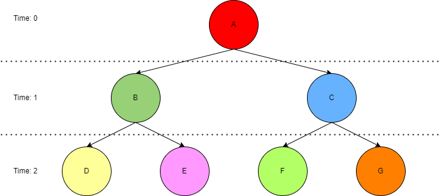
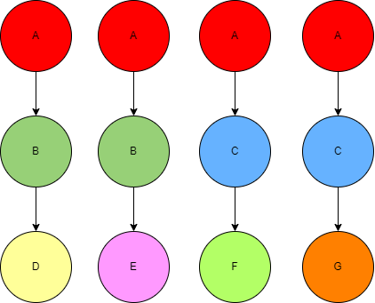

# Simulator Strategies explained 

### Tree data structure
The simulator represents the evolution of a forest stand with a tree data structure. The forestry operations (growth, thinning etc.) done at different time points are represented by the tree nodes, and different operation alternatives are represented by the branching of the nodes. A generic binary tree is represented below:


In the simulator, nodes are called `Step`s. A `Step` has the information of its parent `Step`, and its child `Steps` (branches). The state of a `Step` is a prepared processor (more in [README.md](../README.md)), which is a lambda function that can manipulate the simulation state.


## Simulation run strategies

The simulator can be run in two different ways, which are called strategies.`full` strategy executes `run_full_tree_strategy`, whereas `partial` strategy executes `run_partial_tree_strategy`. 

It should be noted that while the `full` strategy is simpler to understand, it carries a significant memory and runtime overhead for large simulation trees, and therefore the ``partial` strategy should be focused on as the performant solution.

The strategies are described at a high level below.

## Full tree strategy

Assume the tree structure from eariler:


The `full` strategy will traverse the whole simulation tree (using post-order traversal) to produce a list of operation chains, i.e. a list of all the possible paths in the tree, from root to leaf:



This list of chains will be iterated over, and each chain will be run independent from each other. 

To illustrate the performance issue with the full tree strategy, let's imagine that Step C is a thinning operation, but there is a constraint in place (set in `control.yaml`) which prohibits this operation from running at this point of the simulation. Given this, the third chain will fail at C and not be returned as part of the simulation results. However, the fourth chain does not know about the failure at C, and will blindly try to execute it too. Therefore in this example, half of the simulator's work was redundant. The `partial` strategy offers a solution to this.

## Partial tree strategy

The main difference the partial tree strategy has compared to the full tree strategy is that it executes the operations in the tree nodes (i.e. `Steps`) as it traverses down the tree (i.e. moves forward in time, in a breadth-first like manner). 

"Partial" in the strategy name refers to the fact that the strategy creates trees from only the nodes in one time point at a time (i.e. partial trees/subtrees) and traverses those partial trees (with the same post-order traversal algorithm) to create partial (or sub-) chains of operations. Therefore, the strategy can be thought to be depth-first within time points, but breadth-first across time points.

Consider the same tree:


First, the operations at time 0 will be run. That produces an `OperationPayload` result, which will be passed on to the operations at the next time point as input. In this case, A will run successfully, and its output is passed on to operations in Steps B and C. Let's assume B will run successfully, but C will again fail due to a constraint. Therefore, the iteration at time 1 will only produce one `OperationPayload` result (from B), that is passed on to time 2. At time 2, the simulator will then run the defined generators (steps D and E) only for that one input payload. In other words, the simulator will not consider Steps F and G, because step C has already failed.


## other

The previous examples have considered the simple binary tree. However, for the purposes of the simulator and MELA, it's good to understand what a more realistic simulation tree can look like.

Consider a simulator instruction such as:

```yaml
simulation_events:
  - time_points: [0,5]
    generators:
      - sequence:
        - grow
      - alternatives:
        - do_nothing
        - thinning
```
 which will produce a simulator tree like below:


the `full` strategy would create four simulation chains (one for each possible path in the tree) and run them independently from one another.

the `partial` strategy, on the other hand, would proceed as follows:

1. create operation chains from the nodes in the first time point:
